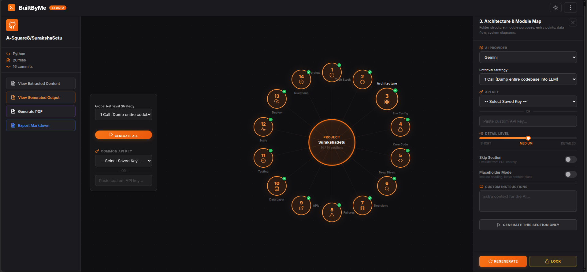
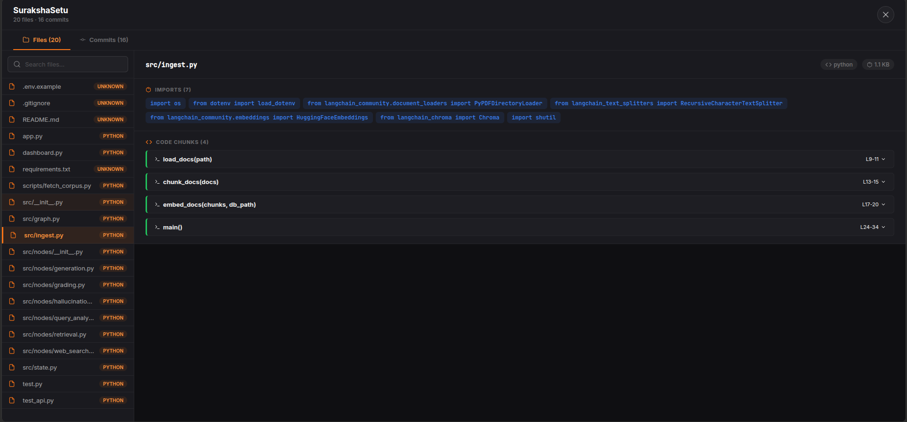
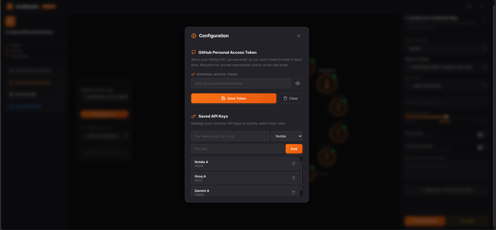
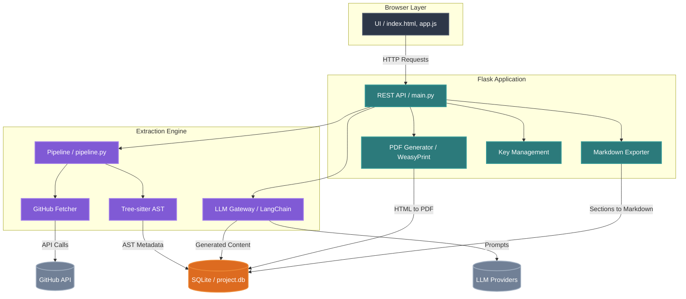

# BuiltByMe

**AI-Powered Technical Documentation & Interview Prep Engine**

[](LICENSE)
[](https://www.python.org/)
[](https://flask.palletsprojects.com/)
[](https://www.langchain.com/)
[](https://tree-sitter.github.io/)

*Turn any GitHub repository into a 14-section technical report and interview guide — powered by Tree-sitter AST parsing and LLMs.*

</div>

---

## What It Does

BuiltByMe bridges the gap between raw source code and high-level architectural understanding. Point it at any GitHub repo and it will:

1. **Extract** - Clone the repo via GitHub API, parse every file's AST using Tree-sitter, and store structured metadata (imports, classes, functions, methods) in a local SQLite database.
2. **Analyze** - Send intelligent, targeted code chunks to your choice of LLM (Groq, Gemini, Nvidia) to generate structured, schema-validated documentation.
3. **Generate** - Produce a beautiful, print-ready PDF or Markdown file with 14 documentation sections ranging from architecture diagrams to interview question banks.

> **Privacy First**: All parsing happens locally. Only the specific code chunks needed for analysis are sent to LLM providers. Your API keys are encrypted at rest.

---

## Sample Document

**[SurakshaSetu](https://github.com/A-Square8/SurakshaSetu)**: https://drive.google.com/file/d/1WO3igBTqfqa0X_uFaZSh3maaWsKK_UvZ/view?usp=sharing

---

## Screenshots

<div align="center">
  
  <br/>
  
  <br/>
  
</div>

---

## Key Features

| Feature | Description |
|---|---|
| **AST-Powered Extraction** | Tree-sitter parses 12+ languages locally - no code leaves your machine during extraction |
| **Multi-Provider LLM** | Switch between Groq, Gemini, and Nvidia on a per-section basis |
| **14 Documentation Sections** | From Project Overview to Interview Question Bank |
| **2-Pass Retrieval** | Skeleton analysis -> targeted file retrieval to optimize token usage |
| **Premium PDF Export** | Styled reports with Mermaid diagrams, colored badges, and dark headers |
| **Markdown Export** | Download full documentation as a structured `.md` file |
| **Encrypted Key Vault** | Fernet-encrypted API key storage with auto-generated master key |
| **Radial Generator UI** | Interactive section-by-section generation with per-section customization |
| **Dark/Light Theme** | Toggle between dark and light modes with smooth transitions |
| **Toast Notifications** | Elegant glassmorphic notifications replacing browser alerts |
| **Keyboard Shortcuts** | Power-user shortcuts for fast navigation (`Ctrl+K`, `Ctrl+N`, etc.) |
| **Fine-Grained Control** | Detail level slider, skip/placeholder toggles, custom instructions per section |

---

## Architecture



For a detailed architecture breakdown, see [docs/ARCHITECTURE.md](docs/ARCHITECTURE.md).

---

## Quick Start

### Prerequisites

- **Python 3.10+**
- **pip** (Python package manager)
- An API key from at least one supported LLM provider:
  - [Groq](https://console.groq.com/) (free tier available)
  - [Google Gemini](https://aistudio.google.com/apikey) (free tier available)
  - [Nvidia NIM](https://build.nvidia.com/) (free credits available)

### Installation

```bash
# Clone the repository
git clone https://github.com/YOUR_USERNAME/BuiltByMe.git
cd BuiltByMe

# Create and activate a virtual environment
python3 -m venv .venv
source .venv/bin/activate   # On Windows: .venv\Scripts\activate

# Install dependencies
pip install -r requirements.txt
```

### Running

```bash
python3 main.py
```

Open your browser to **http://localhost:5000** and you're ready to go.

### First Project

1. Click the **⋮ menu** -> **New Project**
2. Paste a GitHub repository URL (e.g., `https://github.com/pallets/flask`)
3. Click **Start Extraction** - watch the progress bar as files are parsed
4. Once extracted, go to **⋮ menu** -> **Configuration** -> add your LLM API key
5. Click any section node on the radial generator -> configure -> **Generate This Section**
6. Click **Generate PDF** or **Export Markdown** to download your report

---

## Keyboard Shortcuts

| Shortcut | Action |
|----------|--------|
| `Ctrl+N` | New Project |
| `Ctrl+K` | Search Projects |
| `Ctrl+,` | Open Configuration |
| `Ctrl+G` | Generate PDF |
| `Ctrl+M` | Export Markdown |
| `Esc` | Close any modal/overlay |

---

## Supported Languages

BuiltByMe uses [Tree-sitter](https://tree-sitter.github.io/) for AST-level code intelligence. The following languages have dedicated extractors:

| Language | Imports | Classes | Functions | Methods | Deep Extraction |
|---|---|---|---|---|---|
| Python | ✅ | ✅ | ✅ | ✅ | ✅ Docstrings, decorators, calls |
| JavaScript | ✅ | ✅ | ✅ | ✅ | ✅ Arrow functions, exports |
| TypeScript | ✅ | ✅ | ✅ | ✅ | ✅ Interfaces, return types |
| Java | ✅ | ✅ | ✅ | ✅ | ✅ Annotations, enums |
| C | ✅ | — | ✅ | — | ✅ Structs, includes |
| C++ | ✅ | ✅ | ✅ | — | ✅ Structs, classes |
| Go | ✅ | — | ✅ | ✅ | ✅ Type declarations |
| Rust | ✅ | ✅ | ✅ | ✅ | ✅ Impl blocks, traits |
| Kotlin | ✅ | ✅ | ✅ | ✅ | ✅ Companion objects |
| Ruby | ✅ | ✅ | ✅ | — | Generic extractor |
| PHP | ✅ | ✅ | ✅ | — | Generic extractor |
| C# | ✅ | ✅ | ✅ | — | Generic extractor |
| HTML | — | — | — | — | Scripts, links, meta tags |
| CSS | — | — | — | — | Selectors, variables, media queries |

Languages not in this table still get basic extraction via the **generic extractor** which captures imports, functions, and classes using common AST node patterns.

---

## Supported LLM Providers

| Provider | Model | Structured Output | Free Tier |
|---|---|---|---|
| **Groq** | Llama 3.1 8B Instant |  Native | Generous |
| **Google Gemini** | Gemini 2.5 Flash |  Native | Generous |
| **Nvidia NIM** | StepFun Step 3.5 Flash |  Via PydanticOutputParser | Free credits |

Adding new providers is straightforward - see [CONTRIBUTING.md](CONTRIBUTING.md#adding-a-new-llm-provider).

---

## Project Structure

```
BuiltByMe/
├── main.py                    # Flask server, all API routes, PDF + Markdown generation
├── requirements.txt           # Python dependencies
├── config.json                # Local config (gitignored — auto-generated)
├── .master.key                # Encryption key (gitignored — auto-generated)
├── extraction/                # Core extraction engine
│   ├── pipeline.py            # Orchestrates the full extraction flow
│   ├── github_fetcher.py      # GitHub REST API client
│   ├── extractors.py          # Language-specific Tree-sitter extractors
│   ├── ts_parser.py           # Tree-sitter parser initialization
│   ├── language_detector.py   # File extension → language mapping
│   ├── file_filter.py         # Directory/file skip rules
│   ├── database.py            # SQLite project database (ProjectDB)
│   ├── llm_gateway.py         # Multi-provider LLM client (LangChain)
│   └── prompts.py             # Pydantic schemas + system prompts for all 14 sections
├── ui/                        # Frontend (served as static files)
│   ├── index.html             # Main SPA with all modals
│   ├── app.js                 # Core UI logic (projects, viewer, config, themes)
│   ├── generator.js           # Radial generator UI + section generation
│   ├── style.css              # Base styles, design tokens, theme system
│   └── generator.css          # Generator-specific styles
├── docs/                      # Documentation
│   ├── ARCHITECTURE.md        # Technical architecture deep-dive
│   └── API.md                 # REST API reference
├── LICENSE                    # MIT License
├── CONTRIBUTING.md            # Contribution guide
└── CHANGELOG.md               # Release history
```

---

## Configuration

### GitHub Personal Access Token (PAT)

For private repositories or to avoid rate limits, save your GitHub PAT:

1. Go to **⋮ menu** -> **Configuration**
2. Paste your PAT -> **Save Token**

The token is encrypted using Fernet and stored locally in `config.json`.

### LLM API Keys

1. Go to **⋮ menu** -> **Configuration** -> **Saved API Keys**
2. Enter a name, select the provider, paste the key -> **Add**
3. Keys appear in the generator dropdown for quick selection

### Custom Ignore Patterns

When adding a project, you can specify comma-separated glob patterns to exclude files:

```
*.csv, docs/, *.test.js, node_modules, __pycache__
```

### Theme

Click the **☀/🌙 toggle** in the header to switch between dark and light modes. Your preference is saved automatically.

---

## Contributing

We welcome contributions! See [CONTRIBUTING.md](CONTRIBUTING.md) for guidelines on:

- Setting up the development environment
- Adding new LLM providers
- Adding Tree-sitter language support
- Submitting pull requests

---

## License

This project is licensed under the [MIT License](LICENSE).

---

## Acknowledgments

- [Tree-sitter](https://tree-sitter.github.io/) — Blazing-fast, incremental parsing
- [LangChain](https://www.langchain.com/) — LLM orchestration framework
- [WeasyPrint](https://weasyprint.org/) — CSS-based PDF rendering
- [Mermaid.ink](https://mermaid.ink/) — Diagram rendering service
- [Flask](https://flask.palletsprojects.com/) — Lightweight Python web framework

---

<div align="center">

**Built by [Ankit Ambasta](https://github.com/A-Square8)**

*If this tool helped you, consider giving it a ⭐*


