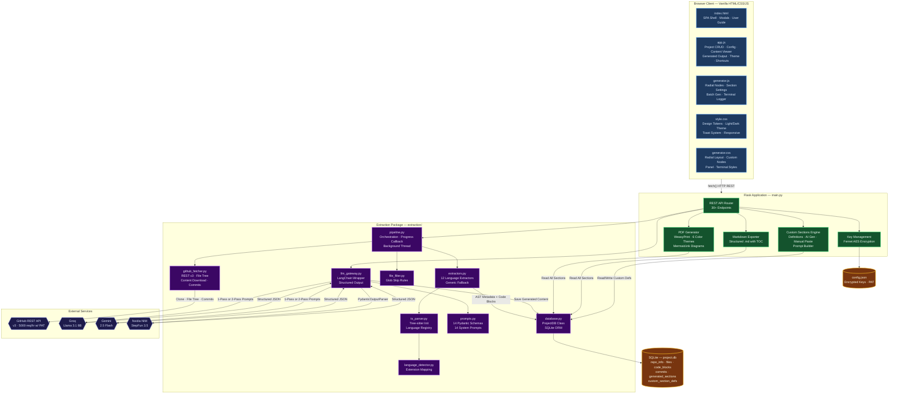

# BuiltByMe - Architecture

This document provides a comprehensive technical overview of BuiltByMe's architecture, data flow, and internal design decisions.

## System Overview

BuiltByMe is a **Flask-based web application** that combines local AST parsing with remote LLM analysis to generate structured technical documentation from GitHub repositories.



---

## Core Components

### 1. Extraction Pipeline (`extraction/pipeline.py`)

The `ExtractionPipeline` class orchestrates the complete extraction flow:

```
GitHub URL -> Fetch Repo Info -> Fetch Commits -> Get File Tree -> Filter Files
                                                                    │
                                                         For each file:
                                                         ├─ Fetch content via API
                                                         ├─ Detect language
                                                         ├─ Parse AST (Tree-sitter)
                                                         ├─ Extract metadata + blocks
                                                         └─ Save to SQLite
```

**Key Design**: Progress is reported via a callback function, enabling the frontend to show real-time extraction progress. The pipeline runs in a background thread (`threading.Thread`) so the Flask server remains responsive.

### 2. GitHub Fetcher (`extraction/github_fetcher.py`)

Uses the GitHub REST API v3 to:
- Fetch repository metadata (name, description, language, stars, etc.)
- Retrieve the full file tree recursively (`/git/trees/{branch}?recursive=1`)
- Download individual file contents (base64 decoded)
- Fetch commit history

**Rate Limiting**: Unauthenticated requests are limited to 60/hour. With a PAT, this increases to 5,000/hour.

### 3. Tree-sitter Extractors (`extraction/extractors.py`)

Each supported language has a dedicated extractor function that produces:
- **Metadata**: Imports, classes (with methods, superclasses, decorators), functions (with params, return types, docstrings, call graphs)
- **Blocks**: Logical code chunks with `block_type`, `name`, `parent_name`, `start_line`, `end_line`, and `content`

The extractor architecture follows a consistent pattern:
```python
def extract_LANGUAGE(source: bytes) -> tuple[dict, list[dict]]:
    tree = parse_code(source, 'language_name')
    root = tree.root_node
    # ... walk the AST using _walk_tree() ...
    return metadata_dict, blocks_list
```

**Fallback**: Languages without a dedicated extractor use `extract_generic()`, which searches for common AST node types across all grammars.

### 4. LLM Gateway (`extraction/llm_gateway.py`)

A unified interface over LangChain chat models:

```python
result = generate_content(
    provider='groq',           # or 'gemini', 'nvidia'
    api_key='...',
    system_prompt='...',
    user_prompt='...',
    response_schema=MyPydanticModel  # For structured output
)
```

**Structured Output Strategy**:
- **Groq & Gemini**: Use LangChain's `.with_structured_output(schema)` - the LLM returns JSON matching the Pydantic schema directly.
- **Nvidia**: Uses `PydanticOutputParser` which injects format instructions into the system prompt and parses the response post-hoc.

### 5. Prompts & Schemas (`extraction/prompts.py`)

Contains 14 Pydantic `BaseModel` classes (one per documentation section) and 14 corresponding system prompts. Custom sections (ID ≥ 100) created via the UI use a generic `CustomSectionOutput` schema with dynamic prompts based on user-provided instructions. Examples:

| Section | Schema Class | Key Fields |
|---|---|---|
| 1. Project Overview | `Section1Overview` | `summary`, `purpose`, `target_audience` |
| 3. Architecture | `Section3Architecture` | `folder_tree`, `architecture_diagram`, `modules`, `data_flow` |
| 6. Deep Dives | `FrameworkDeepDive` | `basics`, `directly_used_concepts`, `indirect_concepts` |
| 14. Interview Bank | `Section14InterviewBank` | `question_categories`, `curveball_questions`, `red_flags_to_avoid` |

### 6. Database (`extraction/database.py`)

Each extracted project gets its own SQLite database (`my_projects/<name>/project.db`) with tables:

| Table | Purpose |
|---|---|
| `repo_info` | Repository metadata (name, description, language, stars, etc.) |
| `files` | File paths, languages, sizes, and parsed metadata (JSON) |
| `code_blocks` | Semantic code chunks linked to files |
| `commits` | Git commit history |
| `extraction_log` | Extraction status tracking |
| `generated_sections` | LLM-generated content for each of the 14 sections |

### 7. PDF & Markdown Generators (`main.py`)

The PDF pipeline:

1. **Load** all generated sections from SQLite
2. **Render** each section into styled HTML using section-specific templates
3. **Diagrams**: Convert Mermaid text -> base64 -> `mermaid.ink` URL -> `` tag (raster image, not SVG)
4. **Convert** the full HTML to PDF using WeasyPrint
5. **Return** as a downloadable file and save a copy to the project folder

**Why WeasyPrint?**: It supports CSS3 features like `@page` rules, `page-break-before`, and complex layouts that browser-based PDF generators often struggle with.

The Markdown pipeline:
1. **Load** all generated sections from SQLite
2. **Render** each section's Pydantic JSON into structured Markdown using `_render_dict_to_markdown`
3. **Save** as a `.md` file to the project folder and return as a downloadable file.

### 8. Key Management

API keys are encrypted at rest using Python's `cryptography.fernet` library:

```
User enters key -> encrypt_val(key) -> Fernet.encrypt() -> stored in config.json
config.json loaded -> decrypt_val(enc_key) -> Fernet.decrypt() -> used for API call
```

The master Fernet key is auto-generated on first run and stored in `.master.key` (gitignored).

---

## Data Flow: Section Generation

### 1-Pass Strategy

```
Project DB -> All file contents -> Build context string -> LLM -> Pydantic parse -> Save to DB
```

Simple but token-heavy. Best for small repositories.

### 2-Pass Strategy

```
Pass 1: Project DB -> File skeleton (names + metadata, no code)
        -> LLM selects relevant files -> Returns file list

Pass 2: Fetch only selected files -> Build focused context
        -> LLM generates section -> Pydantic parse -> Save to DB
```

Token-efficient. Best for large repositories where the full codebase exceeds context limits.

### Section 6: Chunked Framework Generation

Section 6 (Technology Deep Dives) uses a unique 3-phase approach:

```
Phase 0 (Discovery): All imports + file skeleton -> LLM identifies N frameworks
Phase 1..N (Deep Dive): For each framework:
    -> Fetch relevant files only -> LLM generates deep dive
    -> Merge into section 6 content -> Save
```

This prevents context overflow by analyzing one framework at a time.

---

## Frontend Architecture

The frontend is a single-page application built with vanilla HTML/CSS/JS (no framework):

| File | Responsibility |
|---|---|
| `index.html` | Page structure, all modal templates, User Guide content |
| `app.js` | Project CRUD, content viewer, config management, generated content viewer |
| `generator.js` | Radial section nodes, settings panel, section generation, batch generation, terminal logger |
| `style.css` | CSS custom properties (design tokens), base component styles |
| `generator.css` | Generator-specific styles (radial layout, nodes, panels, terminal) |

### State Management

- `currentProject` - Active project name (global in `app.js`)
- `sectionStates` - Per-section UI state: skip, placeholder, locked, etc. (in `generator.js`)
- `customSections` - Array of user-defined custom sections (title, description, ID ≥ 100) stored per-project in SQLite and rendered as neon-cyan radial nodes (in `app.js` / `generator.js`)
- `currentGeneratedSections` - Cached list of generated sections (in `app.js`)
- `theme` - Light/dark mode preference persisted via `localStorage`
- `toast` - Transient notification state managed via DOM appending/removing (top-center positioned)

### Communication

All frontend-backend communication happens via `fetch()` to REST endpoints. No WebSockets. Extraction progress is polled at 1-second intervals.

---

## Security Considerations

1. **No secrets in version control**: `.master.key`, `config.json`, and `my_projects/` are all gitignored.
2. **Encrypted at rest**: All API keys use Fernet symmetric encryption.
3. **Local processing**: Tree-sitter parsing happens entirely in-process. No code is sent externally during extraction.
4. **Targeted LLM calls**: Only the code chunks relevant to a specific section are sent to LLM providers - never the entire codebase at once (when using 2-pass strategy).
5. **No authentication on local server**: The Flask server binds to `localhost:5000` and is intended for single-user, local use only.
